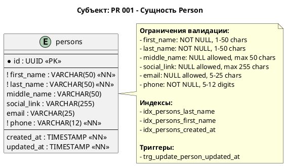

# PDM - Physical Data Model для PersonService

## Статус

Разрабатывается

## Ссылки на PR

| Номер PR | Описание |
|----------|----------|
| [PR 001](../PR/PR%20001%20Person%20entity.md) | Сущность Person |

## Контекст

Модель данных определяет структуру таблиц базы данных для хранения сущностей PersonService. Используется PostgreSQL 18.

## ERD - Entity Relationship Diagram (PR 001)



## Описание сущностей

### Таблица: persons

Хранит основную информацию о людях. Соответствует агрегату `Person` из доменной модели.

**Mapping с доменной моделью:**

| Колонка | Тип | Доменный аналог |
|---------|-----|-----------------|
| id | UUID | EntityId (Value Object) |
| first_name | VARCHAR(50) | FirstName (Value Object) |
| middle_name | VARCHAR(50) | MiddleName (Value Object) |
| last_name | VARCHAR(50) | LastName (Value Object) |
| social_link | VARCHAR(255) | SocialLinkValue (Value Object) |
| email | VARCHAR(25) | Email (Value Object) |
| phone | VARCHAR(12) | Phone (Value Object) |
| created_at | TIMESTAMP | Entity.CreatedAt |
| updated_at | TIMESTAMP | Entity.UpdatedAt |

| Колонка | Тип | Обязательное | Ограничения |
|---------|-----|--------------|-------------|
| id | UUID | Да | PRIMARY KEY |
| first_name | VARCHAR(50) | Да | NOT NULL, CHECK (1-50 chars) |
| last_name | VARCHAR(50) | Да | NOT NULL, CHECK (1-50 chars) |
| middle_name | VARCHAR(50) | Нет | CHECK (max 50 chars) |
| social_link | VARCHAR(255) | Нет | CHECK (max 255 chars) |
| email | VARCHAR(25) | Нет | CHECK (5-25 chars) |
| phone | VARCHAR(12) | Да | NOT NULL, CHECK (5-12 digits) |
| created_at | TIMESTAMP WITH TIME ZONE | Да | DEFAULT CURRENT_TIMESTAMP |
| updated_at | TIMESTAMP WITH TIME ZONE | Да | DEFAULT CURRENT_TIMESTAMP |

## DDL Script

```sql
-- ============================================
-- PersonService Database Schema
-- PostgreSQL 18
-- ============================================

CREATE TABLE IF NOT EXISTS persons (
    id UUID PRIMARY KEY,
    first_name VARCHAR(50) NOT NULL,
    middle_name VARCHAR(50),
    last_name VARCHAR(50) NOT NULL,
    social_link VARCHAR(255),
    email VARCHAR(25),
    phone VARCHAR(12) NOT NULL,
    created_at TIMESTAMP WITH TIME ZONE NOT NULL DEFAULT CURRENT_TIMESTAMP,
    updated_at TIMESTAMP WITH TIME ZONE NOT NULL DEFAULT CURRENT_TIMESTAMP,
    
    CONSTRAINT chk_first_name_length CHECK (LENGTH(first_name) >= 1 AND LENGTH(first_name) <= 50),
    CONSTRAINT chk_middle_name_length CHECK (middle_name IS NULL OR LENGTH(middle_name) <= 50),
    CONSTRAINT chk_last_name_length CHECK (LENGTH(last_name) >= 1 AND LENGTH(last_name) <= 50),
    CONSTRAINT chk_social_link_length CHECK (social_link IS NULL OR LENGTH(social_link) <= 255),
    CONSTRAINT chk_email_length CHECK (email IS NULL OR (LENGTH(email) >= 5 AND LENGTH(email) <= 25)),
    CONSTRAINT chk_phone_length CHECK (LENGTH(phone) >= 5 AND LENGTH(phone) <= 12),
    CONSTRAINT chk_phone_digits CHECK (phone ~ '^[0-9]+$')
);

CREATE INDEX IF NOT EXISTS idx_persons_last_name ON persons(last_name);
CREATE INDEX IF NOT EXISTS idx_persons_first_name ON persons(first_name);
CREATE INDEX IF NOT EXISTS idx_persons_created_at ON persons(created_at);

CREATE OR REPLACE FUNCTION update_updated_at_column()
RETURNS TRIGGER AS $$
BEGIN
    NEW.updated_at = CURRENT_TIMESTAMP;
    RETURN NEW;
END;
$$ language 'plpgsql';

CREATE TRIGGER trg_update_person_updated_at
    BEFORE UPDATE ON persons
    FOR EACH ROW
    EXECUTE FUNCTION update_updated_at_column();
```

## Зависимости

- PostgreSQL 18
- Npgsql Entity Framework Core Provider
- Entity Framework Core 10.x
